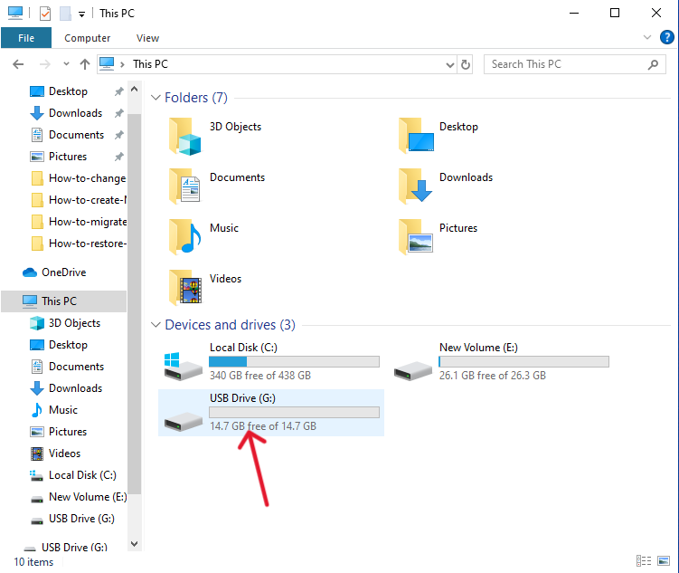

# DiskPart Guide: Clean, Partition, Format, and Assign Letter to Disk

 1. **Open Command Prompt as Administrator**
 
 Type cmd in search bar and select "Command Prompt (Admin)

 Alternatively, search for cmd, right-click it, and select "Run as Administrator".

 2. **Launch DiskPart**
 
                diskpart

 3. **List All Disks**

    List all available disks to identify the disk you want to clean.
 
            list disk

 

 

 4. **Select the Disk**

   Select the disk you want to clean (replace X with the disk number).
  
            select disk X

 

 5. **Clean the Disk**

 Clean the selected disk, which removes all partitions and data.
 
            Clean

 For a more secure clean, use:
 
            Clean all

 ### After "clean all", the disk will show as unallocated.
    Example Output (after clean all):

 
  

 6. **Create a New Partition**

  Create a new primary partition that takes up the entire disk.

         create partition primary

 Alternatively, to create a partition with a specific size (in MB):
 
     create partition primary size=102400   
     
 For a 100 GB partition

 7. **Format the Partition**

Format the partition with the desired file system. 
 Here, we're using NTFS as an   
 
         Format fs=ntfs quick

  

 8. **Assign a Drive Letter**

 Assign a drive letter (e.g., E) to the partition.

         assign letter=G

 9. **Disk allocated**
  
 

 10. **Exit DiskPart**

 Once all steps are completed, 
 exit DiskPart.

         exit