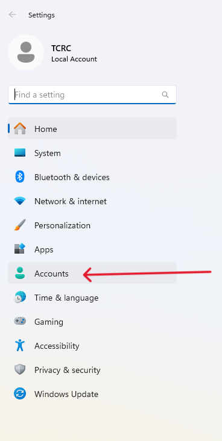
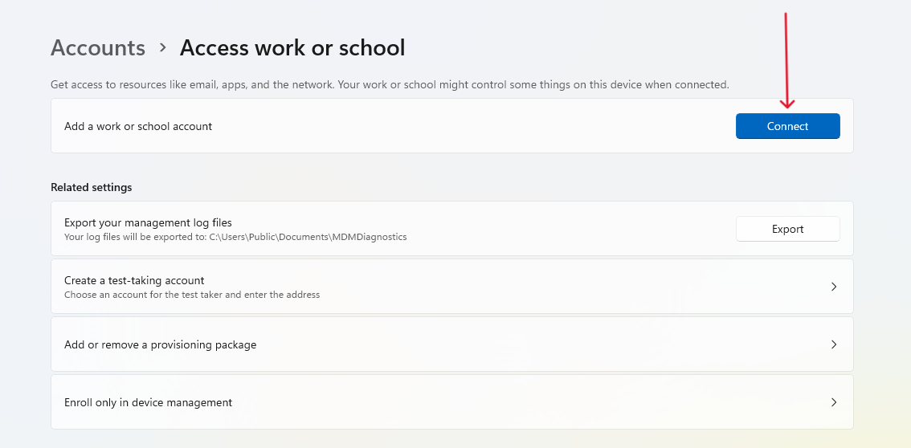

# How to Create an Entra ID

Follow these steps to join your device to Microsoft Entra ID:

1. **Open Settings**  
   Press **Windows + I** on your keyboard to open the Settings menu.

   

2. **Navigate to Account Settings**  
   In the Settings window, select **Accounts** from the list of options.

   

3. **Access Work or School**  
   Under the **Accounts** section, click on **Access work or school**.

   

4. **Connect to Entra ID**  
   Click the **Connect** button to begin the process of linking your device.

   

6. **Join the Device to Microsoft Entra ID**  
   Choose the option to **Join this device to Microsoft Entra ID**.

   

7. **Enter Your Email Address**  
   Provide your email address associated with Microsoft Entra ID.

   

8. **Enter Your Password**  
   Enter the password for your Microsoft Entra ID account.

   

9. **Approve Sign-in Request**  
   You will receive a sign-in request on your **Authenticator app**. Open the app, and enter the code or approve the request to continue.

  

9. **Complete the Joining Process**  
   Click on the **Join** button to finalize the connection.

   

10. **Confirmation**  
   Once the process is complete, you will receive a confirmation that your device is successfully joined to Microsoft Entra ID. 

   
   
   You are all set!

   ## Restart Your computer ##
   

   
