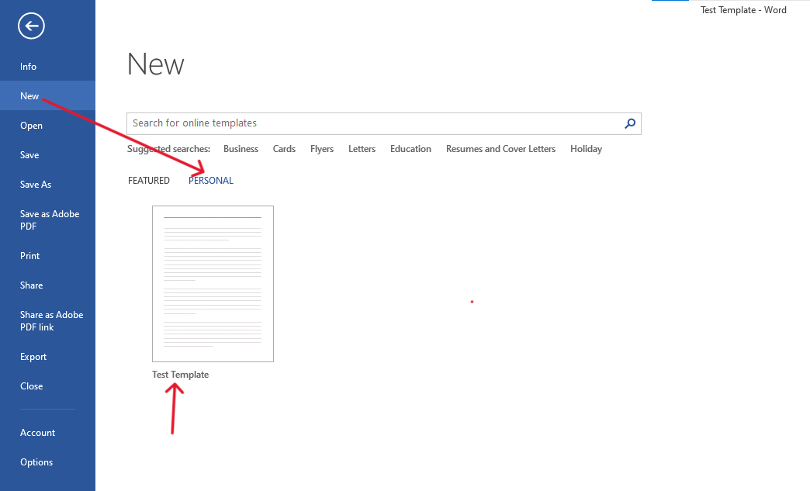

# Creating and Using a Template in Microsoft Word

Follow these steps to create and use a custom template in Microsoft Word:

## Step 1: Open Microsoft Word
- Launch Microsoft Word on your computer.

## Step 2: Design Your Template
- Create the document layout and content that you want to use as your template. 
  - This can include styles, headers, footers, custom fonts, and any other elements you wish to reuse.

  

## Step 3: Save the Template
1. Go to the `File` tab in the top-left corner.

2. Select `Save As`.

3. Click on `Browse` to choose where you want to save the template.

## Step 4: Choose the Template File Type
1. In the "Save As" window, locate the file type dropdown menu.

2. Select `Word Template (*.dotx)` from the list of available file types.

3. Give your template a meaningful name.
4. Choose the location to save the template and click `Save`.

## Step 5: Open Your Saved Template
1. Go to the `File` tab again.

2. Click on `New`.

3. In the `Personal` section, you will see your saved template listed. Click on it to open and use it.

---
Now you can create new documents based on your template with just a few clicks!
---