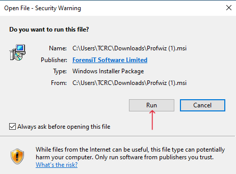
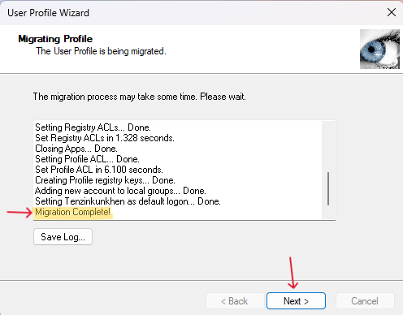

# User Profile Migration Guide

Follow these steps to migrate your user profile using the User Profile Wizard:

1. **Download the User Profile Wizard**  
   - Search for "ForensiT" on Google or go to [Forensit.com](https://www.forensit.com) to download the User Profile Wizard.

   

2. **Go to the Free Download Section**  
   - Navigate to the *Free Download* section of the website.

   

3. **Download the User Profile Wizard for Windows**  
   - Choose the appropriate version of the User Profile Wizard for your Windows operating system and click *Download*.

   

4. **Install the User Profile Wizard**  
   - After downloading, click on the installer file and select *Run* to begin the installation process.

   

5. **Accept the Terms and Conditions**  
   - Review and accept the terms and conditions to proceed with the installation.

   

6. **Launch the User Profile Wizard**  
   - After installation, launch the program by clicking on the User Profile Wizard icon on your desktop.

   

7. **Open the User Profile Wizard**  
   - Click *Next* to begin the profile migration process.

   

8. **Select the Profile to Migrate**  
   - Choose the user profile you wish to migrate and click *Next*.

   

9. **Enter the Account Name**  
   - Provide the new account name for the migration and click *Next*.

   

10. **Start the Profile Migration**  
   - The migration process will begin. Once it completes, click *Next* to proceed.

   

11. **System Restart**  
   - The system will automatically **restart** and load the new migrated account.
