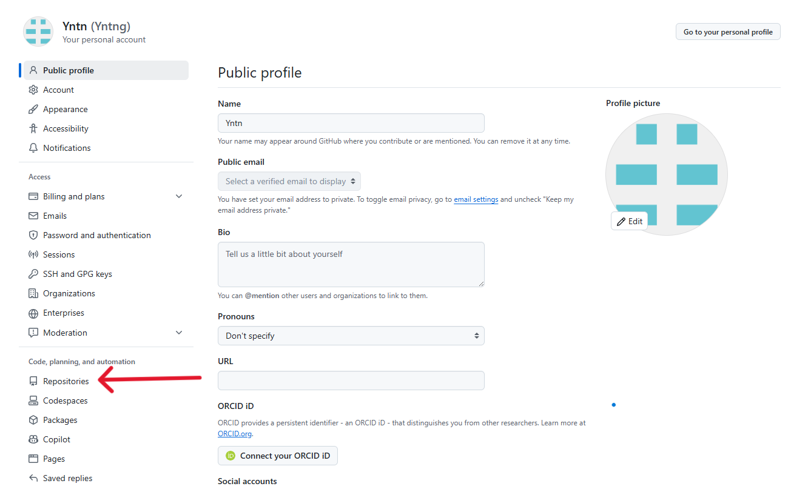
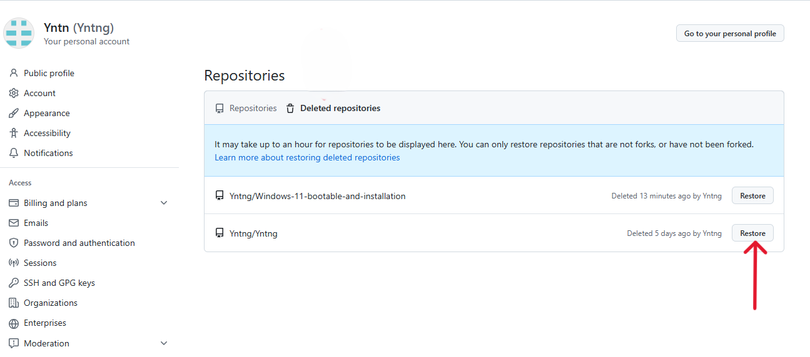

# How to Restore a Deleted Repository on GitHub

GitHub provides a feature to restore deleted repositories, but this option is available only within a limited time after deletion.

## Steps to Restore a Deleted Repository:

1. **Go to GitHub Profile**:
   - Visit [GitHub](https://github.com) and log in to your account.

2. **Navigate to Settings**:
   - Click on your **profile picture** in the top-right corner.
   - Select **Settings** from the dropdown menu.

   

3. **Access Repositories Settings**:
   - In the left-hand sidebar, click on **Repositories** under the **Account Settings** section.

   

4. **Find Deleted Repositories**:
   - Under the "Repositories" section, you will see an option labeled **Deleted repositories**.
   - Click on **Deleted repositories** to view all repositories that have been deleted from your account.

   

5. **Restore the Repository**:
   - A list of your deleted repositories will appear. Next to the repository you wish to restore, click on the **Restore** button.

   

6. **Confirm the Restoration**:
   - After clicking restore, GitHub will restore the repository to its original state, and it will reappear in your list of active repositories.

   

> **Note:** This restore option is only available within a limited period after the repository is deleted. If the repository is deleted for too long, the option may no longer be available.

## Conclusion
You can easily restore a deleted repository on GitHub by following the steps above. Make sure to act quickly after deletion, as the option to restore is available only for a limited time.
