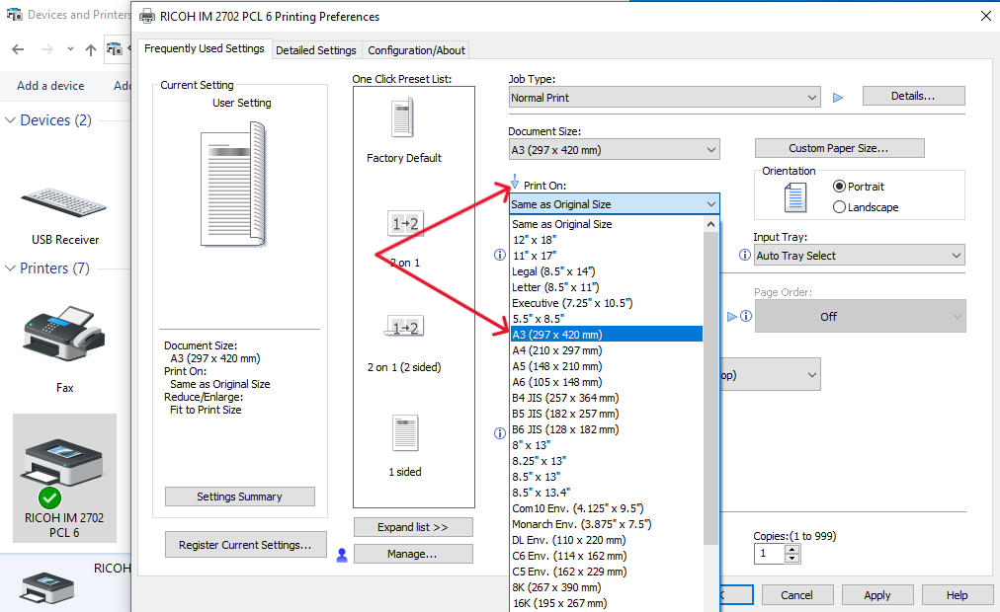

# Printer setting for A3 size paper 

### Setting 1: Printer Preferences
1. Go to --> **Control Panel** 

--> **Devices and Printers**

2. Choose the Printer you are working with.
3. Select and right-click on the printer.
4. Click on **Printer Preferences**.

### Printer Settings:

- **Document Size**: A3 (297 x 420 mm)

- **Print on**: A3 (297 x 420 mm)

- **Input Tray**: Bypass Tray

- **Orientation**: Landscape

---

### Setting 2: Reduce / Enlarge: Fit to Print Size
1. Now, go back to the page you are about to print.
2. Press **Ctrl + P** to open the Print dialog.
3. Select the printer you are using.
4. Choose **A3** as the paper size.
5. Select the **Reduce / Enlarge: Fit to Print Size** option.

6. Click **Print** to send the document to the printer.

---
